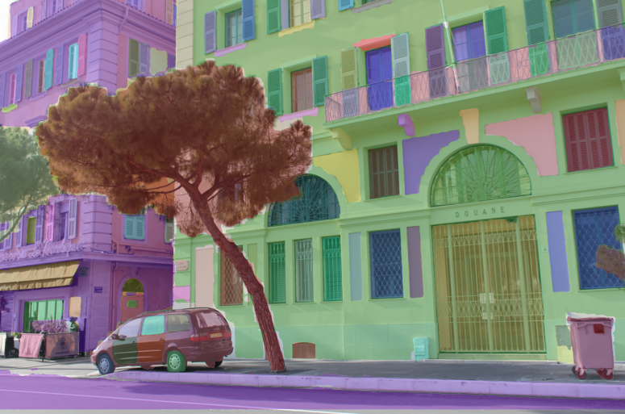
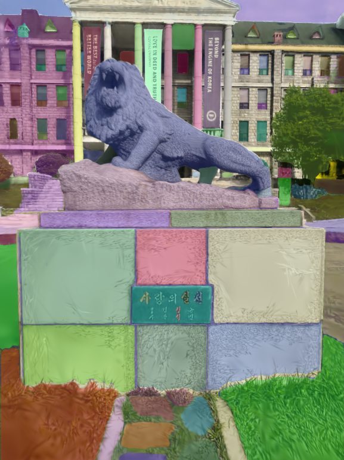

# 3D Scene Reconstruction from Multiple Images

**Graduation Capstone · Computer Vision — Neural Rendering & 3D Gaussian Splatting · February – November 2025**


---

## Demo / Results Gallery

**Tiny NeRF — Truck Spiral (Google Colab)**

<video src="https://github.com/user-attachments/assets/8a4c8b5a-2d04-4cfd-bffe-e6cd1ddd6b64" controls width="100%"></video>

**3DGS — HyLion Statue (20k iterations)**

<video src="https://github.com/user-attachments/assets/dfb18075-a6d5-48ae-8bf9-7a354466c0a8" controls width="100%"></video>

**Scaffold-GS — HyLion Statue**

<video src="https://github.com/user-attachments/assets/19a12be3-41f3-49b8-988e-8da1b1f9fe3d" controls width="100%"></video>

**Feature-GS + SAM — Segmentation on Custom Scene (184 frames)**

<video src="https://github.com/user-attachments/assets/c9c09737-a831-43b6-939b-90debe1f1670" controls width="100%"></video>

---

## Overview

This capstone implements, compares, and extends four state-of-the-art neural rendering methods for photorealistic 3D scene reconstruction from multi-view images: **NeRF**, **Vanilla 3D Gaussian Splatting (3DGS)**, **Scaffold-GS**, and **Feature-GS with SAM-based segmentation**. All methods were replicated and run on **consumer-grade hardware (RTX 2070, 8GB VRAM)**, requiring significant CUDA-level modifications, memory optimizations, and parameter tuning to overcome out-of-memory (OOM) errors that would block standard paper reproduction setups. The project achieves **PSNR of 20–23 dB** and **L1 Loss of 0.062** on self-collected datasets. Scenes were captured in the field using handheld smartphone cameras and processed end-to-end through COLMAP, training, rendering, and semantic segmentation pipelines.

---

## Methods

### 1. NeRF — Neural Radiance Fields

[Mildenhall et al., 2020](https://github.com/bmild/nerf) · Volumetric neural rendering via MLP-based radiance field

NeRF represents a scene as a continuous volumetric function queried by a neural network to synthesize novel views through differentiable ray marching. Two variants were implemented: **Tiny NeRF** as a rapid proof-of-concept on Google Colab, and the **full original NeRF** trained both on the authors' benchmark data and our own self-collected scenes at 100k iterations (~15 hours).

**Tiny NeRF — Truck Spiral (Google Colab, ~1k iterations, PSNR 22–23 dB)**

<video src="https://github.com/user-attachments/assets/8a4c8b5a-2d04-4cfd-bffe-e6cd1ddd6b64" controls width="100%"></video>

**Original NeRF — Fern Dataset (Author Replication, 100k iterations)**

<video src="https://github.com/user-attachments/assets/eb596638-c39f-4c3c-8f4a-8ab3060ad4d4" controls width="100%"></video>

**NeRF — HyLion Statue (Our Data, 20k iterations)**

<video src="https://github.com/user-attachments/assets/ca2151d0-6567-444e-8eef-37e2bbe15c6e" controls width="100%"></video>

**NeRF — Bike Pot (Our Data, 100k iterations)**

<video src="https://github.com/user-attachments/assets/65002fab-a278-47dd-b20d-bc2396d35728" controls width="100%"></video>

---

### 2. Vanilla 3D Gaussian Splatting (3DGS)

[Kerbl et al., 2023](https://github.com/graphdeco-inria/gaussian-splatting) · Real-time rendering via learnable 3D Gaussians

3DGS represents scenes as collections of anisotropic 3D Gaussians rasterized in real time, offering substantially faster rendering than NeRF. Training required a modified `convert.py` for COLMAP preprocessing — the feature extractor and exhaustive matcher were patched for GPU compatibility, and the sparse reconstruction path layout was fixed for custom datasets. Memory-optimized training flags were required throughout.

**3DGS — HyLion Statue (20k iterations)**

<video src="https://github.com/user-attachments/assets/dfb18075-a6d5-48ae-8bf9-7a354466c0a8" controls width="100%"></video>

**3DGS — Club Room / Bike Room (20k iterations)**

<video src="https://github.com/user-attachments/assets/cc5144b2-95ac-403e-a923-387ce591f03b" controls width="100%"></video>

---

### 3. Scaffold-GS

[Lu et al., 2024](https://github.com/city-super/Scaffold-GS) · Anchor-based Gaussian representation for reduced memory footprint

Scaffold-GS replaces the dense Gaussian cloud with a structured anchor grid from which lightweight neural Gaussians are derived at render time. This architectural choice yields significantly lower VRAM consumption than vanilla 3DGS, making it the **recommended method for consumer hardware with limited VRAM**. Manual installation of `torch-scatter` from a pre-built wheel was required for the `scaffold_gs` conda environment.

**Scaffold-GS — HyLion Statue**

<video src="https://github.com/user-attachments/assets/19a12be3-41f3-49b8-988e-8da1b1f9fe3d" controls width="100%"></video>

**Scaffold-GS — Club Room**

<video src="https://github.com/user-attachments/assets/11ca7320-32f6-4063-bac6-2411dde38644" controls width="100%"></video>

---

### 4. Feature-GS + SAM (Segment Anything)

[Feature 3DGS authors](https://github.com/feature-3dgs/feature-3dgs) · [Kirillov et al., 2023](https://github.com/facebookresearch/segment-anything) · Semantic 3D segmentation via per-Gaussian feature embeddings

Feature-GS extends 3DGS by distilling 2D SAM (ViT-H) feature embeddings into per-Gaussian semantic channels, enabling object-level 3D segmentation and interactive scene manipulation. The primary engineering challenge was adapting the CUDA rasterizer to 8GB VRAM: `NUM_SEMANTIC_CHANNELS` in `cuda_rasterizer/config.h` was reduced from 128 to 64. The full pipeline covers SAM embedding export, training with `--speedup`, rendering, and "segment everything" segmentation via `segment.py`.

**Metrics: PSNR 20.65 dB · L1 Loss 0.062**

**Feature-GS + SAM — Author Data Replication (169 frames)**

<video src="https://github.com/user-attachments/assets/9f48d84b-6dfa-4a10-88b8-3d0a010d8f35" controls width="100%"></video>

**Feature-GS + SAM — Our Custom Scene (184 frames)**

<video src="https://github.com/user-attachments/assets/c9c09737-a831-43b6-939b-90debe1f1670" controls width="100%"></video>

**Feature-GS + SAM — HyLion Scene Segmentation**

<video src="https://github.com/user-attachments/assets/d626d448-1e88-4c57-8e90-9d528b1314a9" controls width="100%"></video>

**Segmentation frame — Author data replication:**



**Segmentation frame — Our custom data:**



---

## Datasets & Scenes

All custom scenes were self-collected using handheld smartphone cameras and processed through COLMAP (Structure-from-Motion) for camera pose estimation. Images were preprocessed with ImageMagick prior to COLMAP ingestion.

| Scene | Description | Methods Used |
|---|---|---|
| HyLion Statue | Stone lion statue on university campus | NeRF, 3DGS, Scaffold-GS, Feature-GS |
| Club Room (Bike Room) | Indoor bike storage room | 3DGS, Scaffold-GS |
| Bike Pot | Road bike against a wall | NeRF |
| Monster Can | Energy drink can (tabletop object) | 3DGS |
| Fern | Authors' original benchmark scene | NeRF (replication) |
| Truck | Authors' original benchmark scene | 3DGS (replication) |

---

## Results & Metrics

| Model | PSNR (↑) | L1 Loss | Training Time | Iterations |
|---|---|---|---|---|
| NeRF (Main) | — | — | ~15 hrs | 100k |
| NeRF (Tiny) | 22–23 dB | — | ~1 hr | 1k |
| Vanilla 3DGS | — | — | 1–2 hrs | 20k |
| Scaffold-GS | 20.65 dB | — | 1–1.5 hrs | 7k |
| Feature-GS + SAM | 20.65 dB | 0.062 | 1–2 hrs | 7k |

**Hardware context:** All results were obtained on a single consumer GPU (RTX 2070, 8GB VRAM). Quantitative scores are lower than paper benchmarks due to these hardware constraints and reduced iteration counts. Despite this, all four methods successfully demonstrate their qualitative and quantitative differences on identical scenes, which is the primary goal of this comparative study.

---

## Hardware & Software

### Hardware

| Component | Spec |
|---|---|
| GPU | NVIDIA GeForce RTX 2070 |
| VRAM | 8 GB |
| RAM | 16 GB |
| Storage | 1TB Samsung T5 External SSD |
| OS | Ubuntu 24.04.2 LTS (dual-boot with Windows) |

### Software & Libraries

| Category | Details |
|---|---|
| CUDA | 11.8 (primary), 12.0 (secondary) |
| PyTorch | 2.2.0 / 2.4.0 |
| Python | 3.8 / 3.9 (per conda environment) |
| SfM | COLMAP |
| Segmentation | SAM — Segment Anything Model (ViT-H: `sam_vit_h_4b8939.pth`) |
| Visualization | Open3D, MeshLab, SIBR Viewer |
| Reference | NerfStudio |
| Compiler | GCC 11 (required for CUDA 11.8 rasterizer compilation) |
| Session management | tmux (multi-hour training stability) |

---

## Key Technical Contributions

Each of the following represents a concrete engineering challenge encountered during paper replication on consumer hardware, and the solution developed to overcome it.

1. **CUDA rasterizer memory reduction** — Reduced `NUM_SEMANTIC_CHANNELS` from 128 to 64 in `cuda_rasterizer/config.h`, resolving CUDA OOM errors during Feature-GS training on 8GB VRAM and making the full pipeline runnable on consumer hardware.

2. **COLMAP pipeline repair for custom data** — Modified `convert.py` to enable GPU-accelerated feature extraction and exhaustive matching, and corrected the sparse reconstruction output path layout to be compatible with downstream training scripts.

3. **GCC toolchain downgrade for CUDA 11.8** — Identified and resolved a compiler incompatibility requiring a downgrade from GCC 13 to GCC 11 to successfully compile the CUDA 11.8 rasterizer submodule.

4. **PyTorch memory fragmentation mitigation** — Applied `PYTORCH_CUDA_ALLOC_CONF=expandable_segments:True` to reduce allocator fragmentation and prevent intermittent OOM crashes during Feature-GS training.

5. **Hybrid 2D→3D segmentation pipeline** — Adopted SAM's "segment everything" mode applied to rendered 2D views as an effective and practical workaround for 3D segmentation setup difficulties, producing semantically meaningful per-object outputs.

6. **External storage I/O management** — Mitigated training instability introduced by the Samsung T5 USB-attached SSD through persistent tmux sessions, preventing data loss across multi-hour runs.

7. **Scaffold-GS identified as the VRAM-efficient baseline** — Through empirical comparison, confirmed Scaffold-GS's anchor-based architecture as the most suitable method for VRAM-constrained environments, establishing it as the recommended starting point for low-resource replication.

---

## Environment Setup

### Scaffold-GS (`scaffold_gs`)

```bash
conda create -n scaffold_gs python=3.9 -y
conda activate scaffold_gs

# Install PyTorch with CUDA 11.8
pip install torch==2.2.0 torchvision==0.17.0 torchaudio==2.2.0 --index-url https://download.pytorch.org/whl/cu118

# Install torch-scatter from pre-built wheel (adjust URL for your Python/CUDA version)
pip install torch-scatter -f https://data.pyg.org/whl/torch-2.2.0+cu118.html

# Clone and install Scaffold-GS
git clone https://github.com/city-super/Scaffold-GS --recursive
cd Scaffold-GS
pip install -r requirements.txt
pip install submodules/diff-gaussian-rasterization
pip install submodules/simple-knn
```

> **Note:** GCC 11 is required for CUDA 11.8 rasterizer compilation. Install with `sudo apt install gcc-11 g++-11` and set `CC=gcc-11 CXX=g++-11` before running pip installs of the submodules.

---

### Feature-GS + SAM (`feature_3dgs`)

```bash
conda create -n feature_3dgs python=3.8 -y
conda activate feature_3dgs

# Install PyTorch with CUDA 11.8
pip install torch==2.4.0 torchvision==0.19.0 --index-url https://download.pytorch.org/whl/cu118

# Clone Feature-GS
git clone https://github.com/feature-3dgs/feature-3dgs --recursive
cd feature-3dgs

# Apply VRAM patch before compiling rasterizer:
# In cuda_rasterizer/config.h, set NUM_SEMANTIC_CHANNELS to 64

pip install -r requirements.txt
pip install submodules/diff-gaussian-rasterization
pip install submodules/simple-knn

# Download SAM ViT-H checkpoint
wget https://dl.fbaipublicfiles.com/segment_anything/sam_vit_h_4b8939.pth
```

> **Memory:** Set `PYTORCH_CUDA_ALLOC_CONF=expandable_segments:True` in your shell before training to reduce fragmentation on 8GB VRAM.

---

## Usage / Running

### Feature-GS + SAM Pipeline

```bash
# Step 1: Preprocess with COLMAP
python convert.py -s data/<scene>

# Step 2: Export SAM embeddings from training images
python extract_features.py \
  --image_dir data/<scene>/images \
  --sam_checkpoint sam_vit_h_4b8939.pth \
  --output_dir data/<scene>/features

# Step 3: Train with speedup flag (7k iterations recommended for 8GB VRAM)
export PYTORCH_CUDA_ALLOC_CONF=expandable_segments:True
python train.py \
  -s data/<scene> \
  -m output/<scene> \
  --speedup \
  --iterations 7000

# Step 4: Render scene
python render.py -m output/<scene>

# Step 5: Segment with SAM ("segment everything" mode)
python segment.py \
  -m output/<scene> \
  --sam_checkpoint sam_vit_h_4b8939.pth

# Step 6: Generate novel views and create video
python render_novel_views.py -m output/<scene>
python create_video.py --input output/<scene>/novel_views --output results/output.mp4
```

---

### Vanilla 3DGS Training (Memory-Optimized for 8GB VRAM)

```bash
# COLMAP preprocessing
python convert.py -s data/<scene>

# Memory-optimized training
python train.py -s data/<scene> -m output/<scene> \
  --iterations 7000 \
  --densify_grad_threshold 0.01 \
  --densification_interval 400 \
  --densify_until_iter 4000 \
  --test_iterations -1
```

> For full 20k iteration runs (HyLion, Club Room), remove the iteration overrides and monitor VRAM usage closely.

---

### Scaffold-GS Training

```bash
conda activate scaffold_gs

python train.py \
  -s data/<scene> \
  -m output/<scene> \
  --iterations 7000
```

---

## Repo Structure

```
/
├── README.md
├── /results/              ← all output videos and segmentation images
└── /colab/                ← Google Colab notebooks (Tiny NeRF, etc.)
```

---

## Future Work

1. Retry Feature-GS on simpler, single-object scenes to obtain cleaner segmentation boundaries
2. Implement object and mesh insertion and deletion within reconstructed scenes
3. Explore interactive object manipulation using Open3D within Feature-GS scenes
4. Conduct extended runs at higher iteration counts on higher-VRAM hardware to reach paper-level benchmarks

---

## Acknowledgements

This project builds directly on the following foundational works. We are grateful to their authors for releasing code and model weights openly.

| Method | Authors | Year | Repository |
|---|---|---|---|
| NeRF | Mildenhall et al. | 2020 | [bmild/nerf](https://github.com/bmild/nerf) |
| 3D Gaussian Splatting | Kerbl et al. | 2023 | [graphdeco-inria/gaussian-splatting](https://github.com/graphdeco-inria/gaussian-splatting) |
| Scaffold-GS | Lu et al. | 2024 | [city-super/Scaffold-GS](https://github.com/city-super/Scaffold-GS) |
| Feature 3DGS | Feature 3DGS authors | 2024 | [feature-3dgs/feature-3dgs](https://github.com/feature-3dgs/feature-3dgs) |
| Segment Anything (SAM) | Kirillov et al. | 2023 | [facebookresearch/segment-anything](https://github.com/facebookresearch/segment-anything) |
| Instant-NGP | Müller et al. | 2022 | [NVlabs/instant-ngp](https://github.com/NVlabs/instant-ngp) |

COLMAP SfM pipeline by Schönberger & Frahm, 2016.
